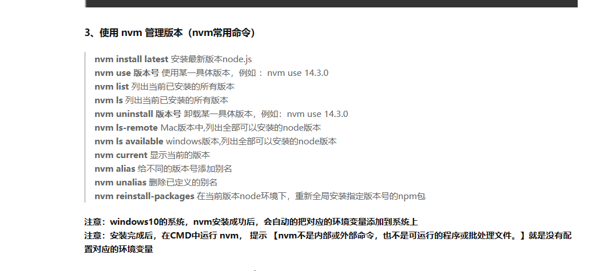

# 1，Window工具软件

1，下载：IDM

​				破解：IDM 授权工具.cm.txt

```
https://wwab.lanzoue.com/iUzVs159cxne
密码:2w37
```

2，md文本编辑：Typora

```
https://wwab.lanzoue.com/iUbX4159c6va
密码:i38q
```

```
（1.48版本）
下载:https://wwab.lanzoue.com/iLCFH15sejkd 
密码:ap52
```

3，window激活：DragonKMS v23.07.02.exe

​								HEU_KMS_Activator_v24.2.0.exe

```
https://wwab.lanzoue.com/imWFx159brsh
密码:hobx
```

4，压缩神器：Bandizip

​				破解：Bandizip专业版激活工具(1).exe

```txt
https://wwab.lanzoue.com/iX1f4159auub
密码:fzgb
```

5，文本快速拷贝：TeraCopy（[TeraCopy for Windows - Code Sector](https://www.codesector.com/teracopy)）

6，文件快速查找：Everything（[下载 - voidtools](https://www.voidtools.com/zh-cn/downloads/)）

7，截图工具：ShareX（steam搜索）

8，人畜无害的猫：Clash for window

```
https://wwab.lanzoue.com/iBw4J159by7i
密码:2ua1
```

9，接口测试工具：Postman（[Download Postman | Get Started for Free](https://www.postman.com/downloads/)）

10，录屏软件：OBS（[下载 | OBS (obsproject.com)](https://obsproject.com/zh-cn/download)）

11，屏幕共享：向日葵（[向日葵远程控制app官方下载 - 贝锐向日葵官网 (oray.com)](https://sunlogin.oray.com/download?categ=personal)）

12，steam加速：Watt TooIkit

13，office激活：OfficeBox_setup_v3.1.0.zip（[Office Tool Plus 官方网站 - 一键部署 Office (landian.vip)](https://otp.landian.vip/zh-cn/)）

​							KMS(https://www.coolhub.top/tech-articles/kms_list.html)

14，落雪音乐：[lyswhut/lx-music-desktop: 一个基于 electron 的音乐软件 (github.com)](https://github.com/lyswhut/lx-music-desktop)

15，node-js版本管理工具：nvm（[nvm-sh/nvm: Node Version Manager - POSIX-compliant bash script to manage multiple active node.js versions (github.com)](https://github.com/nvm-sh/nvm)）

```
https://wwab.lanzoue.com/iVlLU159fs9i
密码:3b18
```

16，windows卸载软件：HiBitUninstaller-Portable

```
https://wwab.lanzoue.com/ir1jK15hc83c
密码:5h8k
```

17，pdf编辑：https://www.yuque.com/yihulaojiu-gsfg9/zz2qv5/vixkf6#gRNHl

# 2，Edge工具插件

1，篡改猴：OCS

​					屏蔽广告

​					视频破解

2，JSONview

3，bilibili下载助手

4，猫抓

5，superCopy

6，青柠起始页

# 3，代码编辑器

1，phpStorm

2，Android Studio

3，IntelliJ IDEA

4，PyCharm

5，HBuilder X

6，eclipse

7，vs Code

8，Navicat

9，Sublime Text

10，[PxCook - 高效易用的自动标注工具,生成前端代码,设计研发协作利器 (fancynode.com.cn)](https://www.fancynode.com.cn/pxcook)

# 4，github

1，git init	初始化git

2，git add .	\- 添加文件到暂存区。

3，git commit -m "提交信息"	 将暂存区内容添加到仓库中。

4，git push	上传远程代码并合并

| 命令             |                   说明                   |
| ---------------- | :--------------------------------------: |
| git init         |                初始化仓库                |
| git clone        |  拷贝一份远程仓库，也就是下载一个项目。  |
| git add          |             添加文件到暂存区             |
| git status       |  查看仓库当前的状态，显示有变更的文件。  |
| git diff         | 比较文件的不同，即暂存区和工作区的差异。 |
| git commit       |          提交暂存区到本地仓库。          |
| git reset        |                回退版本。                |
| git rm           |      将文件从暂存区和工作区中删除。      |
| git mv           |         移动或重命名工作区文件。         |
| git log          |             查看历史提交记录             |
| git blame <file> |   以列表形式查看指定文件的历史修改记录   |
| git remote       |               远程仓库操作               |
| git fetch        |             从远程获取代码库             |
| git pull         |            下载远程代码并合并            |
| git push         |            上传远程代码并合并            |

# 5，nvm


